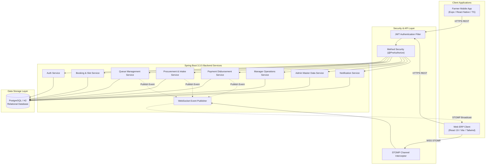
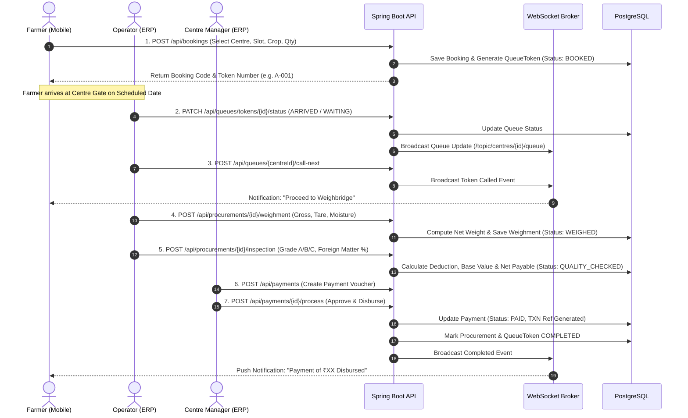
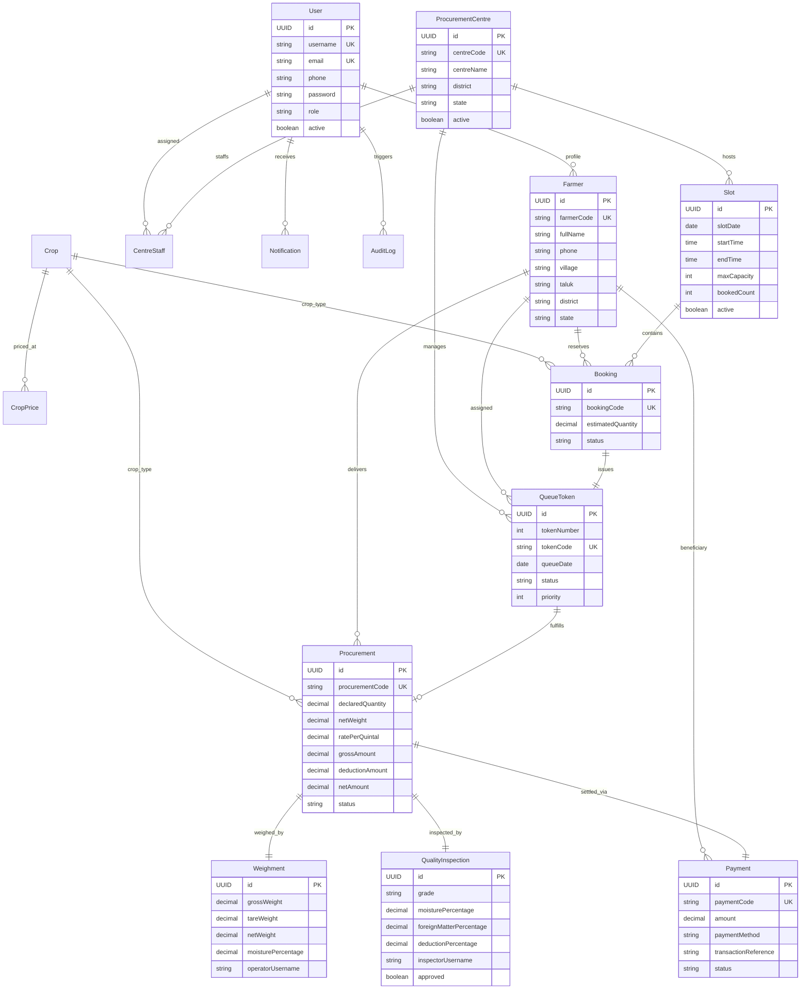

# AGRIPROCURE

> **Agricultural Procurement, Digital Queue Management & Procurement Centre Operations ERP**

[](https://www.oracle.com/java/)
[](https://spring.io/projects/spring-boot)
[](https://react.dev/)
[](https://www.typescriptlang.org/)
[](https://vitejs.dev/)
[](https://expo.dev/)
[](https://reactnative.dev/)
[](https://www.postgresql.org/)
[](LICENSE)

AGRIPROCURE is an enterprise agricultural procurement and queue management platform connecting farmers with regulated government and cooperative procurement centres. It streamlines slot reservations, digital token generation, intake gate verification, weighbridge gross/tare measurement, quality grading, electronic procurement receipts, direct bank transfer (DBT) payment vouchers, and real-time operational monitoring.

---

## Table of Contents

- [Project Overview](#project-overview)
- [Problem Statement](#problem-statement)
- [Solution](#solution)
- [System Architecture](#system-architecture)
- [Operational Lifecycle](#operational-lifecycle)
- [Key Features](#key-features)
  - [Farmer Mobile Application](#1-farmer-mobile-application)
  - [Operator Web ERP Portal](#2-operator-web-erp-portal)
  - [Centre Manager Web ERP Portal](#3-centre-manager-web-erp-portal)
  - [Admin Enterprise ERP Portal](#4-admin-enterprise-erp-portal)
  - [Backend & Core Services](#5-backend--core-services)
- [User Roles & Permissions Matrix](#user-roles--permissions-matrix)
- [Technology Stack](#technology-stack)
- [Database Schema & Core Entities](#database-schema--core-entities)
- [REST API & WebSocket STOMP Specification](#rest-api--websocket-stomp-specification)
- [Security, Authentication & Data Protection](#security-authentication--data-protection)
- [Local Setup & Installation](#local-setup--installation)
  - [Prerequisites](#prerequisites)
  - [Database Setup](#1-database-setup)
  - [Backend Setup](#2-backend-setup)
  - [Frontend Web ERP Setup](#3-frontend-web-erp-setup)
  - [Farmer Mobile Setup](#4-farmer-mobile-setup)
- [Default Test Credentials & Seed Data](#default-test-credentials--seed-data)
- [Automated Testing & End-to-End QA](#automated-testing--end-to-end-qa)
- [Project Directory Structure](#project-directory-structure)
- [Planned Enhancements](#planned-enhancements)
- [License](#license)

---

## Project Overview

Agricultural procurement at regulated market yards and state procurement agencies frequently suffers from congestion, manual paper slips, unpredictable waiting times, and lack of real-time visibility. Farmers travel long distances without certainty regarding daily intake capacity, leading to extended physical queues and post-harvest exposure.

**AGRIPROCURE** provides an end-to-end digital infrastructure that synchronizes farmer intake with centre operational bandwidth:

1. **For Farmers:** A mobile application offering multilingual slot reservations, digital queue tokens, live queue position tracking, quality grade inspection results, and DBT voucher tracking.
2. **For Centre Operators:** A web ERP interface for token check-in, weighbridge integration (gross/tare capture), automated net weight computation, quality inspection recording, and receipt generation.
3. **For Centre Managers:** A command centre for slot capacity scheduling, live yard queue supervision, procurement approval workflows, payment disbursement triggering, staff assignments, and shift reporting.
4. **For System Administrators:** A centralized governance dashboard providing system health diagnostics, crop Minimum Support Price (MSP) master records, procurement centre onboarding, RBAC user management, and immutable audit logs.

---

## Problem Statement

Traditional agricultural procurement centres face several operational bottlenecks:

- **Unregulated Yard Influx:** Farmers arrive simultaneously without scheduled time slots, causing traffic congestion and hours of waiting outside mandi gates.
- **Manual Record Keeping:** Paper tokens, physical weight slips, and inspection registers introduce transcription errors and settlement delays.
- **Zero Queue Visibility:** Farmers in the waiting shed cannot track how many vehicles precede them or when their turn at the weighbridge will arrive.
- **Disjointed Weighment & Quality Verification:** Weight capture and moisture/foreign-matter grading occur in separate registers, delaying net price calculations.
- **Payment Transparency Gaps:** Farmers lack immediate confirmation of quality deductions, net payable amounts, and bank disbursement references.
- **Lack of Multi-Centre Supervision:** Regional administrators lack real-time visibility into daily procurement volumes, center-wise bottlenecks, and crop stock intake.

---

## Solution

AGRIPROCURE bridges the gap between field and procurement centre through a three-tier architecture:

```text
┌─────────────────────────────────────────────────────────────┐
│                   Farmer Mobile Application                 │
│         (React Native / Expo + Multilingual + Offline Cache)│
└──────────────────────────────┬──────────────────────────────┘
                               │ REST API
                               ▼
┌─────────────────────────────────────────────────────────────┐
│                 Spring Boot 3 REST & STOMP Engine           │
│       (JWT Auth, RBAC Filters, Transactional Event Bus)     │
└──────────────┬───────────────────────────────┬──────────────┘
               │ JPA / Hibernate               │ WebSocket / STOMP
               ▼                               ▼
┌──────────────────────────────┐ ┌─────────────────────────────┐
│     PostgreSQL Database      │ │      Web ERP Clients        │
│   (Relational Data Store)    │ │   (Operator / Manager /     │
│                              │ │    Admin Dashboards)        │
└──────────────────────────────┘ └─────────────────────────────┘
```

- **Separation of Concerns:** Distinct user experiences designed specifically for farmers on mobile devices and procurement staff on responsive desktop web ERP portals.
- **Unified Ledger:** Every transaction—from slot booking to queue token, weighment, inspection, and payment voucher—is linked via strict relational keys.
- **Real-Time Synchronization:** WebSocket STOMP protocol pushes queue status transitions and operational updates instantly across connected clients.

---

## System Architecture



---

## Operational Lifecycle



---

## Key Features

### 1. Farmer Mobile Application
- **Farmer Authentication:** Secure login using registered credentials, JWT token lifecycle with `expo-secure-store`.
- **Multilingual Support:** Complete runtime language toggle between English and Tamil (தமிழ்).
- **Offline-First Cache:** Scoped local caching via `cacheStorage.ts` preserving profile, booking, and procurement history with staleness detection.
- **Slot Reservation:** Step-by-step centre selection, date picker, capacity-aware time slot booking, and crop selection.
- **Digital Token & Queue Board:** Live token generation with queue status badges (`BOOKED`, `ARRIVED`, `WAITING`, `WEIGHING`, `QUALITY_CHECK`, `APPROVED`, `COMPLETED`).
- **Procurement Slips & History:** Detailed records showing gross weight, tare weight, moisture content, quality grade, deductions, and net amount.
- **DBT Payment Vouchers:** Direct visibility into payment disbursement status, transaction references, and payment method details.
- **Notification Inbox:** Unread count indicators and event-driven notifications for queue calls, inspections, and disbursements.

### 2. Operator Web ERP Portal
- **Live Queue Desk:** Filterable queue dashboard by date and status with one-click `Call Next Token` orchestration.
- **Token Processing Workflow:** Unified multi-step intake flow to verify farmer identity, record gate arrival, and route to processing.
- **Weighbridge Module:** Gross weight and tare weight entry with automated net weight and moisture deduction calculations.
- **Quality Inspection Module:** Grading parameters (Grade A, B, C, or Rejected), moisture percentage, foreign matter percentage, and quality officer notes.
- **Procurement Slip Generation:** Automatic calculation of gross value, deduction amounts, and final net payable price against active MSP rates.

### 3. Centre Manager Web ERP Portal
- **Operational Command Dashboard:** Live statistics for daily arrivals, intake tonnage, active queue length, and pending disbursements.
- **Slot Capacity Management:** Create, configure, activate, and deactivate daily procurement time slots and farmer quota limits.
- **Live Queue Supervision:** Override token states, handle exceptions, and monitor waiting room throughput.
- **Procurement & Quality Approval:** Review completed weighments and inspections prior to commercial closure.
- **Payment Disbursement Authorization:** Generate and process direct payment vouchers with simulated banking reference generation.
- **Staff Directory:** Roster management of weighbridge operators and inspection staff assigned to the centre.
- **Operational Reports:** Exportable shift reports summarizing total tonnage, crop breakdown, and financial settlements across custom date ranges.

### 4. Admin Enterprise ERP Portal
- **System-Wide Analytics:** Global overview of total registered farmers, active procurement centres, aggregate procurement volume, and total DBT payout.
- **User & RBAC Management:** Onboard, update, activate/deactivate system users across all roles (`ADMIN`, `CENTRE_MANAGER`, `OPERATOR`, `FARMER`).
- **Farmer Master Registry:** Centralized registry of farmer profiles, landholding locations, contact numbers, and KYC codes.
- **Procurement Centre Configuration:** Setup and manage regulated market centres, addresses, contact details, and operational status.
- **Crop Master & MSP Pricing Engine:** Manage crop varieties (Paddy, Wheat, Maize, Cotton) and maintain effective date-bound Minimum Support Price (MSP) records per quintal.
- **Global Audit Trail:** Comprehensive event log tracking system actions, user sessions, target entities, and audit timestamps.
- **System Diagnostics:** Live system health metrics, memory usage indicators, database connectivity probe, and active configuration parameters.

### 5. Backend & Core Services
- **RESTful Endpoints:** 13 specialized Spring Boot controllers covering all domain boundaries.
- **Stateless JWT Security:** JJWT 0.12.6 implementation with `Bearer` token validation and Spring Security 6 filter chain.
- **Method-Level RBAC:** Granular `@PreAuthorize("hasRole(...)")` and `@PreAuthorize("hasAnyRole(...)")` enforcement.
- **Centre-Level Data Isolation:** Custom security expressions preventing operators and managers from accessing data outside their assigned centre.
- **Real-Time STOMP Broker:** Integrated WebSocket message broker with destination channel authorization interceptors.
- **Transactional Event Bus:** `WebSocketEventPublisher` synchronized with database transaction commits (`afterCommit`) to ensure zero phantom broadcasts.
- **Database Portability:** Configured with HikariCP connection pooling for PostgreSQL with fallback capability to in-memory H2 for development and evaluation.

---

## User Roles & Permissions Matrix

| Capability / Module | FARMER | OPERATOR | CENTRE_MANAGER | ADMIN | Platform |
| :--- | :---: | :---: | :---: | :---: | :--- |
| **Login & Profile Management** | Yes (Self) | Yes (Self) | Yes (Self) | Yes (All) | Mobile / Web ERP |
| **View Active Crops & MSP Prices** | Yes | Yes | Yes | Yes | Mobile / Web ERP |
| **View Centres & Available Slots** | Yes | Yes | Yes | Yes | Mobile / Web ERP |
| **Book Procurement Slot** | Yes (Self) | No | No | No | Mobile |
| **View Queue Position & Status** | Yes (Self) | Yes (Centre) | Yes (Centre) | Yes (All) | Mobile / Web ERP |
| **Call Next Token in Queue** | No | Yes (Centre) | Yes (Centre) | Yes (All) | Web ERP |
| **Record Weighbridge Intake** | No | Yes (Centre) | Yes (Centre) | Yes (All) | Web ERP |
| **Record Quality Inspection** | No | Yes (Centre) | Yes (Centre) | Yes (All) | Web ERP |
| **Manage Slot Capacities & Quotas** | No | No | Yes (Centre) | Yes (All) | Web ERP |
| **Authorize & Disburse Payments** | No | No | Yes (Centre) | Yes (All) | Web ERP |
| **View Centre Staff & Shift Reports** | No | No | Yes (Centre) | Yes (All) | Web ERP |
| **Manage Users & Centre Assignments**| No | No | No | Yes | Web ERP |
| **Configure MSP Rates & Crops** | No | No | No | Yes | Web ERP |
| **System Diagnostics & Audit Logs** | No | No | No | Yes | Web ERP |

---

## Technology Stack

### Backend
| Technology | Version | Description |
| :--- | :--- | :--- |
| **Java** | 17+ | Core programming language (JDK 17 LTS verified) |
| **Spring Boot** | 3.3.5 | Primary application framework |
| **Spring Data JPA** | 3.3.5 | Hibernate ORM data access layer |
| **Spring Security** | 6.3.4 | Stateless security filter chain & RBAC |
| **Spring WebSocket** | 3.3.5 | STOMP message broker for live real-time sync |
| **JJWT** | 0.12.6 | Java JSON Web Token (jjwt-api, impl, jackson) |
| **Jakarta Validation**| 3.0.2 | Bean validation annotations (`@Valid`, `@NotNull`) |
| **PostgreSQL Driver** | 42.7.4 | Production relational database driver |
| **H2 Database** | 2.2.224| In-memory development & testing fallback |
| **Apache Maven** | 3.9+ | Build management & dependency resolution |

### Frontend (Web ERP)
| Technology | Version | Description |
| :--- | :--- | :--- |
| **React** | 19.2.8 | Declarative UI framework |
| **TypeScript** | 6.0.2 | Strict static typing |
| **Vite** | 8.2.2 | Fast next-generation frontend build tool |
| **Tailwind CSS** | 3.4.17 | Utility-first responsive enterprise styling |
| **React Router** | 7.18.3 | Client-side routing and protected route guards |
| **TanStack Query** | 5.102.8| Asynchronous state management and caching |
| **Axios** | 1.20.0 | HTTP client with automatic auth interceptors |
| **React Hook Form** | 7.87.0 | High-performance form state management |
| **Zod** | 4.5.4 | Schema validation for user inputs |
| **@stomp/stompjs** | 7.3.0 | STOMP client over WebSocket |
| **sockjs-client** | 1.6.1 | Fallback transport client for WebSocket |
| **Lucide React** | 1.38.0 | Clean, accessible vector icons |

### Farmer Mobile Application
| Technology | Version | Description |
| :--- | :--- | :--- |
| **React Native** | 0.86.3 | Cross-platform native mobile runtime |
| **Expo SDK** | 57.0.19| Mobile application framework and toolchain |
| **React Navigation**| 7.3.18 | Native stack navigation and route transitions |
| **Expo Secure Store**| 57.0.3 | Encrypted on-device keychain/keystore token storage |
| **i18n Engine** | Custom | Context-based English / Tamil language engine |
| **Offline Cache** | Custom | Resilient JSON cache storage with TTL validation |

---

## Database Schema & Core Entities

The system utilizes 15 relational JPA entities managed through Hibernate ORM:



---

## REST API & WebSocket STOMP Specification

### 1. REST Endpoints Summary

| Method | Endpoint | Access Role | Description |
| :--- | :--- | :--- | :--- |
| `GET` | `/api/health` | Public | System health check probe |
| `POST` | `/api/auth/login` | Public | Authenticate user and issue JWT token |
| `GET` | `/api/auth/me` | Authenticated | Retrieve authenticated user profile |
| `GET` | `/api/crops` | Public | List all active crops |
| `GET` | `/api/crops/{id}/prices` | Public | Get historical and current MSP price records |
| `GET` | `/api/centres` | Public | List all procurement centres (`?activeOnly=true`) |
| `GET` | `/api/centres/{id}/slots` | Public | List slots for a centre (`?date=YYYY-MM-DD`) |
| `POST` | `/api/centres/{id}/slots` | Manager, Admin | Create a new capacity slot |
| `PATCH`| `/api/slots/{id}/status` | Manager, Admin | Activate/deactivate a slot |
| `POST` | `/api/bookings` | Farmer | Book a procurement slot and issue queue token |
| `GET` | `/api/bookings/{id}` | Self / Staff | Get booking details by ID |
| `GET` | `/api/farmers/{farmerId}/bookings` | Self / Staff | List bookings for a farmer |
| `GET` | `/api/centres/{centreId}/bookings` | Staff | List bookings for a procurement centre |
| `GET` | `/api/queues/{centreId}` | Public | Get daily queue overview (`?date=YYYY-MM-DD`) |
| `GET` | `/api/queues/farmers/{farmerId}` | Self / Staff | Get queue tokens for a farmer |
| `PATCH`| `/api/queues/tokens/{id}/status` | Operator, Manager, Admin | Update token status (`ARRIVED`, `WAITING`, etc.) |
| `POST` | `/api/queues/{centreId}/call-next`| Operator, Manager, Admin | Call next waiting token to active processing |
| `GET` | `/api/procurements` | Operator, Manager, Admin | List all procurement records |
| `GET` | `/api/procurements/token/{queueTokenId}` | Operator, Manager, Admin | Get or initialize procurement slip for token |
| `POST` | `/api/procurements` | Operator, Manager, Admin | Record procurement intake |
| `POST` | `/api/procurements/{id}/weighment` | Operator, Manager, Admin | Record gross and tare weighbridge weights |
| `POST` | `/api/procurements/{id}/inspection` | Operator, Manager, Admin | Record quality grading and deduction |
| `GET` | `/api/payments` | Manager, Admin | List payment vouchers |
| `POST` | `/api/payments` | Manager, Admin | Create a payment voucher |
| `POST` | `/api/payments/{id}/process` | Manager, Admin | Authorize and disburse payment voucher |
| `GET` | `/api/manager/dashboard` | Manager, Admin | Centre manager live operational dashboard |
| `GET` | `/api/manager/reports` | Manager, Admin | Centre operational and financial reports |
| `GET` | `/api/manager/staff` | Manager, Admin | List centre staff members |
| `GET` | `/api/admin/dashboard` | Admin | System-wide analytics overview |
| `GET` | `/api/admin/users` | Admin | List all system users |
| `POST` | `/api/admin/users` | Admin | Create a new user with assigned role |
| `PUT` | `/api/admin/users/{id}` | Admin | Update user details and role |
| `PATCH`| `/api/admin/users/{id}/status` | Admin | Enable/disable user account |
| `POST` | `/api/admin/crops` | Admin | Create a new crop variety |
| `POST` | `/api/admin/prices` | Admin | Create date-bound MSP price record |
| `GET` | `/api/admin/audit` | Admin | Retrieve system audit logs with filters |
| `GET` | `/api/admin/system/health` | Admin | Retrieve live system health diagnostics |
| `GET` | `/api/notifications` | Self, Admin | Get user notifications |
| `PATCH`| `/api/notifications/{id}/read` | Self, Admin | Mark notification as read |

---

### 2. WebSocket / STOMP Real-Time Topics

- **STOMP Endpoint:** `/ws` (with SockJS fallback)
- **Authentication:** `Authorization: Bearer <JWT_TOKEN>` header sent during STOMP `CONNECT` frame.

| Destination Topic | Access Level | Description |
| :--- | :--- | :--- |
| `/topic/centres/{centreId}/queue` | Public | Live queue updates (token state changes, next called) |
| `/topic/centres/{centreId}/operations` | Centre Staff / Admin | Live procurement, weighment, and inspection events |
| `/topic/admin/operations` | Admin Only | System-wide administrative activity feed |
| `/user/queue/notifications` | Authenticated User | Personal real-time notifications for token calls and payments |

---

## Security, Authentication & Data Protection

- **Stateless Architecture:** No HTTP session state is stored on the server; all identity context is extracted per-request from the signed JWT bearer token.
- **Cryptographic Signing:** Standard HMAC-SHA256 signature verification configured via `app.security.jwt.secret`.
- **Password Encryption:** Industry-standard `BCryptPasswordEncoder` with salt rounds for all user credentials.
- **Granular Scoping:** Staff users (`OPERATOR`, `CENTRE_MANAGER`) are strictly scoped via `SecurityUtils.canAccessCentreData()` to prevent horizontal privilege escalation.
- **Farmer Data Privacy:** Farmers can only access their own bookings, tokens, procurements, and notifications via `SecurityUtils.canAccessFarmerData()`.
- **CORS Protection:** Configurable allowed origins (`app.cors.allowed-origins`) restricting unauthorized web cross-origin requests.
- **Audit Logging:** Critical state alterations (user creation, status changes, payments) record timestamped entries in the `audit_logs` table.

---

## Local Setup & Installation

### Prerequisites
- **Java Development Kit (JDK):** Version 17 or higher
- **Node.js:** Version 18.x or higher & `npm`
- **Maven:** Version 3.9+ (or use the included `./mvnw` wrapper)
- **PostgreSQL:** Version 14+ *(Optional: The backend will automatically fall back to an in-memory database if PostgreSQL is not running)*
- **Expo CLI:** `npx expo` (included with npm dependencies)

---

### 1. Database Setup

#### Option A: PostgreSQL (Recommended for Production/Full Persistence)
1. Start your local PostgreSQL server:
   ```bash
   # Windows
   net start postgresql-x64-16
   # Linux / macOS
   sudo systemctl start postgresql
   ```
2. Create the database:
   ```sql
   CREATE DATABASE agriprocure;
   ```
3. Update `backend/.env` or export environment variables:
   ```properties
   DB_URL=jdbc:postgresql://localhost:5432/agriprocure
   DB_USERNAME=postgres
   DB_PASSWORD=postgres
   DB_DRIVER=org.postgresql.Driver
   JPA_DATABASE_PLATFORM=org.hibernate.dialect.PostgreSQLDialect
   JPA_DDL_AUTO=update
   ```

#### Option B: In-Memory Database (Zero-Config Evaluation)
If no external database is configured, the backend automatically boots using an in-memory PostgreSQL-compatible H2 engine. All tables and seed data will be created automatically.

---

### 2. Backend Setup

1. Navigate to the backend directory:
   ```bash
   cd d:\agri_proto\backend
   ```
2. Build and run the Spring Boot service:
   ```bash
   # Using Maven Wrapper (Windows PowerShell / CMD)
   .\mvnw.cmd spring-boot:run

   # Using Maven Wrapper (Linux / macOS)
   ./mvnw spring-boot:run

   # Or standard Maven
   mvn spring-boot:run
   ```
3. Verify the backend health check:
   ```bash
   curl http://localhost:8080/api/health
   ```
   **Expected Response:**
   ```json
   {
     "status": "UP",
     "service": "AGRIPROCURE"
   }
   ```

---

### 3. Frontend Web ERP Setup

1. Open a new terminal and navigate to the frontend directory:
   ```bash
   cd d:\agri_proto\frontend
   ```
2. Install npm dependencies:
   ```bash
   npm install
   ```
3. Start the Vite development server:
   ```bash
   npm run dev
   ```
4. Access the Web ERP in your browser:
   ```text
   http://localhost:5173
   ```

---

### 4. Farmer Mobile Setup

1. Open a third terminal and navigate to the mobile directory:
   ```bash
   cd d:\agri_proto\farmer-mobile
   ```
2. Install dependencies:
   ```bash
   npm install
   ```
3. Start the Expo Metro Bundler:
   ```bash
   npx expo start
   ```
4. Launch the application:
   - **Web Preview:** Press `w` in the terminal to open the mobile client in a browser.
   - **Android Emulator / Device:** Press `a` or scan the QR code using the **Expo Go** mobile app.
   - **iOS Simulator:** Press `i` (macOS required).

---

## Default Test Credentials & Seed Data

The database is pre-seeded on startup with realistic procurement centres, active MSP prices, slots, and test accounts:

| Role | Username | Password | Linked Entity / Details |
| :--- | :--- | :--- | :--- |
| **System Administrator** | `admin` | `Admin@123` | System Headquarters (All Centres) |
| **Centre Manager** | `manager` | `Manager@123` | Pollachi Procurement Centre (`PC-001`) |
| **Weighbridge Operator** | `operator` | `Operator@123` | Pollachi Procurement Centre (`PC-001`) |
| **Farmer 1** | `farmer1` | `Farmer@123` | Muthusamy K (Code: `FAR-000001`, Anaimalai) |
| **Farmer 2** | `farmer2` | `Farmer@123` | Selvaraj P (Code: `FAR-000002`, Kinathukadavu) |
| **Farmer 3** | `farmer3` | `Farmer@123` | Ramasamy G (Code: `FAR-000003`, Kottur) |
| **Farmer 4** | `farmer4` | `Farmer@123` | Muruganandham S (Code: `FAR-000004`, Vettaikaranpudur) |
| **Farmer 5** | `farmer5` | `Farmer@123` | Velusamy T (Code: `FAR-000005`, Negamam) |
| **Farmer 6** | `farmer6` | `Farmer@123` | Arunachalam N (Code: `FAR-000006`, Zamin Uthukuli) |

### Pre-Configured Master Data
- **Procurement Centres:**
  - `PC-001`: Pollachi Procurement Centre (Regulated Market Yard, Main Road, Pollachi)
  - `PC-002`: Coimbatore Procurement Centre (Central Grain Yard, Trichy Road, Singanallur)
- **Crop MSP Rates:**
  - `PADDY` (Common / Grade-A): **₹2,300.00 / Quintal**
  - `WHEAT` (Milling Quality): **₹2,275.00 / Quintal**
  - `MAIZE` (Hybrid Feed): **₹2,090.00 / Quintal**
  - `COTTON` (Medium Staple): **₹6,620.00 / Quintal**

---

## Automated Testing & End-to-End QA

The repository includes backend unit/integration tests and automated end-to-end PowerShell simulation suites:

### 1. Backend Integration Tests (JUnit 5 & MockMvc)
```bash
cd backend
mvn test
```
**Test Suites:**
- `AuthAndSecurityIntegrationTest`: JWT token generation, unauthorized access blocking, and RBAC matrix validation.
- `CoreBackendIntegrationTest`: Complete procurement lifecycle from booking to payment voucher creation.
- `RealtimeEventPublishingTest`: STOMP event publication and topic routing verification.
- `HealthControllerTest`: Endpoint availability and health response structure.

### 2. End-to-End Multi-Session Automation Suites
Run the PowerShell verification scripts with the backend running on `http://localhost:8080`:

```powershell
# Complete End-to-End QA & Edge-Case Verification (Multi-role session orchestration)
.\test_e2e_final_qa.ps1

# Real-time WebSocket Event & Subscription Test
.\test_step8_realtime.ps1

# Centre Manager Operations & Reporting Verification
.\test_step6_manager.ps1

# Administrator Master Data & Diagnostics Test
.\test_step7_admin.ps1
```

---

## Project Directory Structure

```text
agri_proto/
├── backend/                              # Spring Boot 3.3.5 Java Backend
│   ├── src/
│   │   ├── main/
│   │   │   ├── java/com/agriprocure/
│   │   │   │   ├── AgriprocureApplication.java
│   │   │   │   ├── config/               # CORS, Seed Data, WebSocket Broker Config
│   │   │   │   ├── controller/           # 13 REST API Controllers
│   │   │   │   ├── dto/                  # Data Transfer Objects & Request/Response records
│   │   │   │   ├── entity/               # 15 JPA Relational Entities & Enums
│   │   │   │   ├── exception/            # Global Exception Handler & Error Models
│   │   │   │   ├── repository/           # 15 Spring Data JPA Repositories
│   │   │   │   ├── security/             # JWT Filter, Custom UserDetails, RBAC Utils
│   │   │   │   ├── service/              # Domain Business Services
│   │   │   │   └── websocket/            # STOMP Event Publishing Engine
│   │   │   └── resources/
│   │   │       └── application.yml       # Application Profiles & DB Configuration
│   │   └── test/                         # JUnit 5 & MockMvc Integration Test Suites
│   ├── pom.xml                           # Maven Dependencies & Build Setup
│   └── .env.example
│
├── frontend/                             # React 19 + TypeScript + Vite Web ERP
│   ├── src/
│   │   ├── api/                          # Centralized Axios Client & API Endpoints
│   │   ├── auth/                         # JWT Auth Context & Token Handlers
│   │   ├── components/                   # UI Design System (Button, Card, Table, Modal)
│   │   ├── layouts/                      # Enterprise ERP Shell (Sidebar, Topbar, Alerts)
│   │   ├── pages/
│   │   │   ├── admin/                    # Admin ERP (Users, Centres, Crops, MSP, Audit)
│   │   │   ├── manager/                  # Centre Manager ERP (Slots, Queue, Reports, Staff)
│   │   │   └── operator/                 # Operator ERP (Queue, Weighbridge, Inspection)
│   │   ├── realtime/                     # STOMP / SockJS WebSocket Context & Sync Hooks
│   │   ├── routes/                       # React Router v7 Protected Route Registry
│   │   └── types/                        # TypeScript Interfaces & API Types
│   ├── package.json
│   ├── tailwind.config.js
│   └── vite.config.ts
│
├── farmer-mobile/                        # React Native / Expo Mobile Application
│   ├── src/
│   │   ├── api/                          # Axios Client with Auto-Auth Interceptors
│   │   ├── components/                   # Mobile Atomic Components
│   │   ├── context/                      # Auth Context & Network Connectivity Monitor
│   │   ├── i18n/                         # English & Tamil Localization Dictionaries
│   │   ├── navigation/                   # React Navigation Native Stack
│   │   ├── screens/
│   │   │   ├── auth/                     # Farmer Login Screen
│   │   │   └── main/                     # Home, Slot Booking, Queue Tracker, Payments
│   │   ├── services/                     # Mobile API Service Wrappers
│   │   └── storage/                      # SecureStore Token & Offline Cache Storage
│   ├── app.json                          # Expo Application Manifest
│   └── package.json
│
├── test_e2e_final_qa.ps1                 # Full Multi-Session End-to-End QA Script
├── test_step8_realtime.ps1               # WebSocket Event Verification Script
├── test_step6_manager.ps1                # Manager Operations Test Script
├── test_step7_admin.ps1                  # Admin Configuration Test Script
├── .gitignore                            # Production-Grade Environment & Build Ignores
└── README.md                             # Comprehensive Project Documentation
```

---

## Planned Enhancements

The following features represent future architectural enhancements designed to extend the existing AGRIPROCURE platform:

- **Direct IoT Weighbridge Serial Interface:** WebSerial / RS-232 hardware bridge for automated gross/tare scale readings without manual operator typing.
- **Biometric Aadhaar e-KYC Verification:** Integration with UIDAI biometric authentication gateway at the mandi gate for tamper-proof farmer verification.
- **SMS & WhatsApp Gateway Integration:** Automated SMS/WhatsApp delivery for booking confirmation codes, queue arrival alerts, and DBT payment vouchers.
- **Computer-Vision Quality Grading:** Automated grain quality and foreign-matter percentage estimation via edge camera inspection.
- **Multi-lingual Voice Interface:** Interactive Voice Response (IVR) slot reservation and audio queue status updates for illiterate farmers.

---

## License

This project is licensed under the [MIT License](LICENSE).
